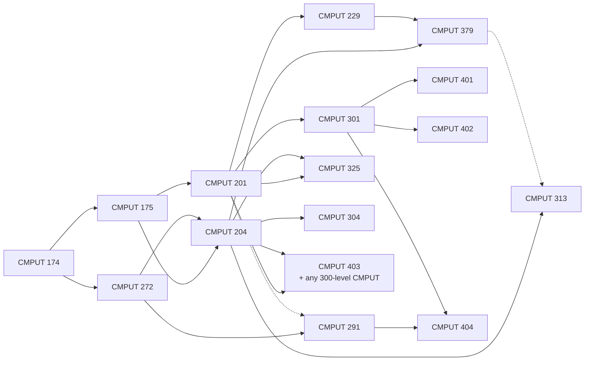
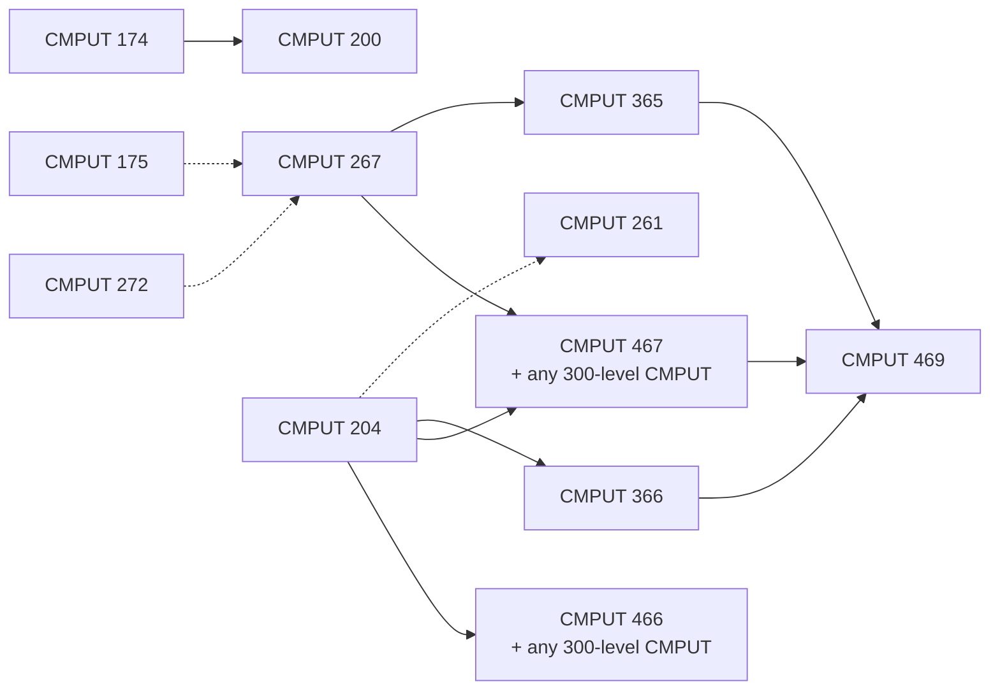

# Degree Planning

The thing that pushes students into a fifth year is almost always a prerequisite chain they noticed too late. This page maps the chains, gives two sample plans that satisfy them, and covers the BSc rules your electives have to fill.

Which path you're in changes your required courses, not the chains. See the [Program Overview](program-overview.md) for path requirements and [Math and Stats](math-and-stats.md) for the math side.

---

## Prerequisite Map

Every edge below comes from the course's [catalogue page](https://apps.ualberta.ca/catalogue/course/cmput) (checked October 2026). **Solid arrows are prerequisites; dotted arrows are corequisites** (can be taken the same term). Where a course needs several things, it needs all of them. To keep the maps readable, they show only CMPUT courses and leave out arrows already implied by another path (379 needs 201, but that's implied by 229). Math and stats prerequisites are in the table below.

### Core, systems, and software

### AI and machine learning

Math and stats prerequisites for the courses above:

| Course | Also needs |
|---|---|
| 200, 261 | Intro stats |
| 204 | Calculus I |
| 267 | Calculus I; linear algebra and intro stats (corequisites allowed) |
| 304 | Intro stats and linear algebra |
| 313 | Intro stats |
| 325 | Linear algebra |
| 466 | Linear algebra, Calculus II, and intro stats |
| 467 | Calculus II |

See [Math and Stats](math-and-stats.md) for which courses count as Calculus I/II, linear algebra, and intro stats.

Simplifications to know:

- **274/275 track:** 274 stands in for 174 everywhere above. 275 satisfies every "175" and "201" arrow, and the "201 **and** 204" pairs on 313, 325, and 379. It does **not** replace 204 for 403 or 467, and you still take 204 in every path.
- **365** accepts 267, 466, **or** STAT 265. **469** accepts 261 or 366, and 466 or 467. **261** accepts 204 or 275.
- **466 vs 467:** 466 is a one-course alternative to the 267 + 467 sequence, and you can't get 466 credit after 467 ([CMPUT 466](https://apps.ualberta.ca/catalogue/course/cmput/466)). AI Option students take 267 and 467.
- **CMPUT 391** (Database Management Systems) is still in the calendar, but the catalogue shows no scheduled offerings since Winter 2022 ([CMPUT 391](https://apps.ualberta.ca/catalogue/course/cmput/391)). Don't plan around it.

**The critical path is 174 → 272 → 204.** 204 needs 175, 272, *and* Calculus I, and almost every 300-level course needs 204. Take 272 in your second term so 204 can follow in your third.

### Courses that only run in one term

Based on the catalogue's term listings for 2025-26 and 2026-27. Offerings can change, so check the catalogue before you build a plan around these.

| Fall only | Winter only |
|---|---|
| 274, 300, 304, 312, 328, 350, 403, 455, 461 | 275, 313, 325, 467, 469, 474 |

MATH 117 and 127 are Fall only; MATH 118 and 136 are Winter only.

---

## Sample Plans

**Illustrative only.** Each CMPUT, MATH, and STAT course below is placed after all of its catalogue prerequisites (and with or after its corequisites), and one-term courses are in the term they run. We checked this with a script against the catalogue entries, not by eye. "+ n" means other courses: ENGL/WRS, breadth, lab science, electives. Confirm against your [Academic Advisement Report](#registration-and-your-degree-audit) before you register.

### Major in Computing Science, 4 years

| Term | CS, math, and stats | Other |
|---|---|---|
| Y1 Fall | CMPUT 174, MATH 144, MATH 125, STAT 151 | + 1 |
| Y1 Winter | CMPUT 175, CMPUT 272, MATH 146 | + 2 |
| Y2 Fall | CMPUT 201, CMPUT 204, CMPUT 200 | + 2 |
| Y2 Winter | CMPUT 229, CMPUT 291 | + 3 |
| Y3 Fall | CMPUT 301, CMPUT 379, CMPUT 304 | + 2 |
| Y3 Winter | CMPUT 313, CMPUT 325 | + 3 |
| Y4 Fall | CMPUT 401, CMPUT 403 | + 3 |
| Y4 Winter | CMPUT 404 | + 4 |

This covers the Major: all three of 201/229/291 (only two are required, but 229 unlocks 379 and 291 unlocks 404), 200 for ethics, 15 units of 300-level (301, 304, 313, 325, 379), and 9 units of 400-level. Swap the 300/400-level picks for whatever interests you; just respect the map.

### Honors, AI Option, starting with 274/275

| Term | CS, math, and stats | Other |
|---|---|---|
| Y1 Fall | CMPUT 274, MATH 117, MATH 127, STAT 151 | + 1 |
| Y1 Winter | CMPUT 275, CMPUT 272, MATH 118 | + 2 |
| Y2 Fall | CMPUT 204, CMPUT 229, CMPUT 267, CMPUT 200, STAT 252 | |
| Y2 Winter | CMPUT 291, CMPUT 261, CMPUT 365, CMPUT 366 | + 1 |
| Y3 Fall | CMPUT 301, CMPUT 379, CMPUT 328, CMPUT 304 | + 1 |
| Y3 Winter | CMPUT 467, CMPUT 313, CMPUT 325 | + 2 |
| Y4 Fall | CMPUT 455, CMPUT 461, CMPUT 403 | + 2 |
| Y4 Winter | CMPUT 469, CMPUT 404 | + 3 |

Notes on this plan:

- Because of 275, there is no 201. **301 is the replacement** for 201 that the calendar requires, so it doesn't also count toward the 18 units of 300/400-level electives (379, 304, 313, 325, 403, 404 do).
- 328 fills the "one of 312/328/340/350" slot; 455 and 461 fill "two of 412/455/461/463".
- Year 2 is the crunch: four or five CMPUT courses per term. If that's too much, push 366 to Year 3 (it runs both terms).
- Using MATH 125 and the 134/144/154 calculus instead works the same way; Honors just also accepts 117/118/127.

### Summer

174, 175, and 272 have had Spring/Summer sections recently, as have most first-year MATH and STAT courses (MATH 125, 144, 146, 154, 156; STAT 151, 252). Upper-year CMPUT courses generally have not. Check the catalogue's term list for a course before counting on it.

---

## Choosing Electives

The BSc has requirements beyond your CS subject area. From the [BSc program page](https://calendar.ualberta.ca/preview_program.php?catoid=69&poid=110969):

| Requirement | What it takes |
|---|---|
| Communication/Writing | 6 units of ENGL or WRS |
| Indigenous course | 3 units from the BSc Indigenous Course List |
| Breadth outside Science | 6 units, at least 3 from each of two categories: Applied Sciences; Business; Humanities, Fine Arts, and Performing Arts; Social Sciences |
| Breadth within Science | 9 units, at least 3 from each of Basic, Formal, and Specialized Sciences |
| Lab/Field experience | 3 units of a Science course on the Lab/Field list |
| Science courses | 72 units total |
| Senior courses | 78 units at the 200 level or higher (so at most 42 units at the 100 level) |
| 300/400-level courses | 36 units for a Major, 42 for Honors |

The eligible course lists for each category are linked from that calendar page. Courses can count for more than one of these (for example, a CS requirement can also satisfy a breadth category), so check before spending a slot.

Electives worth considering for their CS payoff (prerequisites from the [MATH catalogue](https://apps.ualberta.ca/catalogue/course/math)):

- **MATH 214 (Calculus III) and MATH 225 (Linear Algebra II):** together they unlock **CMPUT 340** (Numerical Methods), which feeds robotics (312, 412). 214 is also the corequisite for STAT 265. Details on [Math and Stats](math-and-stats.md).
- **MATH 256 (Elementary Number Theory):** needs only MATH 125 or 127. Pairs with CMPUT 331 (Computational Cryptography).
- **MATH 381 (Numerical Methods):** overlaps CMPUT 340; you can't get credit for 381 alongside or after 340.
- **PHIL 120 (Symbolic Logic I):** sentential and predicate logic, an Arts course with familiar material if you've done CMPUT 272.

---

## Registration and Your Degree Audit

- **Academic Advisement Report (AAR):** your degree audit in Bear Tracks (labelled *Academic Requirements*). It maps your completed, transferred, and in-progress courses onto your program requirements and updates as soon as you change your registration. There's also a **What-If Report** for trying a different path ([Science Student Services](https://www.ualberta.ca/en/science/student-services/your-academics/academic-advisement-report.html)). Check it every term before registering.
- **CS undergraduate advising:** email [csugrad@ualberta.ca](mailto:csugrad@ualberta.ca) or book an appointment from the department's [Undergraduate Studies page](https://www.ualberta.ca/en/computing-science/undergraduate-studies/index.html). Go with your AAR open and a specific question.
- **Course substitutions and double-counting** (a course required by two subject areas) need an Academic Advisor's approval, per the [BSc calendar](https://calendar.ualberta.ca/preview_program.php?catoid=69&poid=110969).

---

*Last verified: October 2026 against the [course catalogue](https://apps.ualberta.ca/catalogue/course/cmput) and the [2026-27 calendar](https://calendar.ualberta.ca/preview_program.php?catoid=69&poid=110935).*
